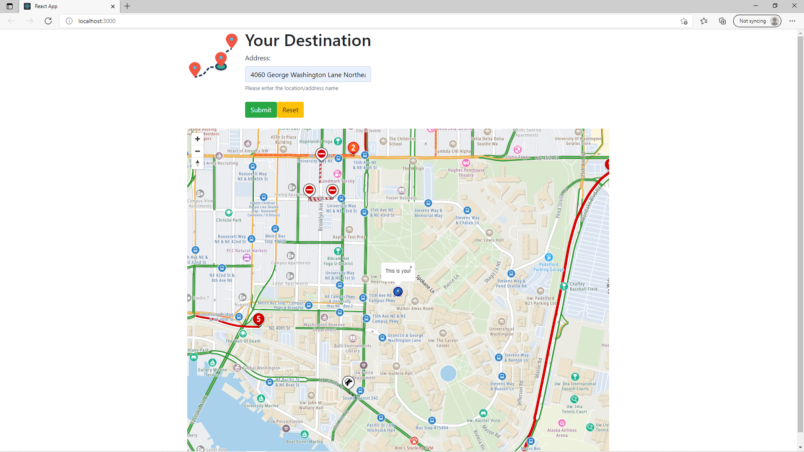

# Your Destination

Creating a responsive map that allows users can be interactive.

## About this Project

Welcome to "Your Direction" web! Created using React!
<br/>


I have used Google Maps API before to create a simple website that displays the location of an address.
But this time I wanted to create a website with a map that can be interactive!
Draggable functions distance calculation, and even displaying the live traffic information (such as accidents and ongoing construction).

All of this was possible using APIs within React! Learning about new technologies is always challenging but I had a lot of fun!

### Built with
* React
* Google Maps API
* Tom Tom API
* HTML/CSS
* Bootstrap

### Main Page

This is the Main page where the user can see the default location of the map.

* The default location is set to Seattle (Latitude: 47.608013, Longitude: -122.335167)
* The starting marker is displayed at the center of the map, user can drag this to change the location of the marker. Marker style is displayed below...
<br/>


* The message "This is you" is also displayed to assist users to help find the marker easily. This message can be removed by clicking X at the top right.
* Live traffic data is displaying as the user uses the website. Basic information such as Green road means the traffic flow is moderate, Red road means the traffic flow is crowded, and accident marker can be seen sometimes as well.

### Pathing

Users can click anywhere on the map to set a destination marker (colored in orange). The map will automatically connect the two markers with the red line after calculating the fastest route.

* The marker is displayed as the user click on the desire destination. Marker style is displayed below...
<br/>


* The red line shows the fastest route from starting marker to the destination marker. The relative time is calculated using Tom Tom API.

### Search

Any User can use the search bar to type in any address they wish to start from (In this example University of Washington).

* The starting marker position is now changed, however, the user can still drag this marker.
* Other functions are still usable, like choosing the destination marker.
* Searching for an address will convert the location into Longitude and Latitude. (using Geocode and Google Map API) 

### Basic functions

You can definitely use basic map functions such as zoom in and zoom out. Since the map is created using the TomTom API instead of Google Map API, implementing these functions can be a little different.


## Conclusion
Thank you for checking out my project! This was very different from other projects I have worked on so far. Using different technologies is always going to be challenging but I think it's always rewarding and exciting!

 ## Getting Started
Starting out the project is simple, install Front-end (React) application (I named the app name "client")
```
npx create-react-app Your-app-name
```
this will create a folder with the name "Your-app-name"

(Side not, aquire a google map API through https://developers.google.com/maps)
<br/>
(And aquire a Tom Tom api and resources of how to use their service through https://developer.tomtom.com/)

## Contact / About Me
Jin Kim - [Github](https://github.com/kimjin-012) - [LinkedIn](https://www.linkedin.com/in/jin-kim-code/) - [Portfolio](http://jinkim.tech/)
